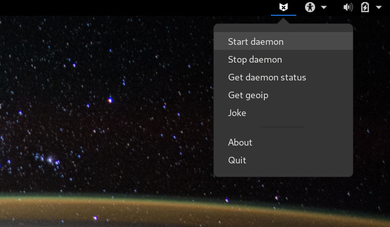
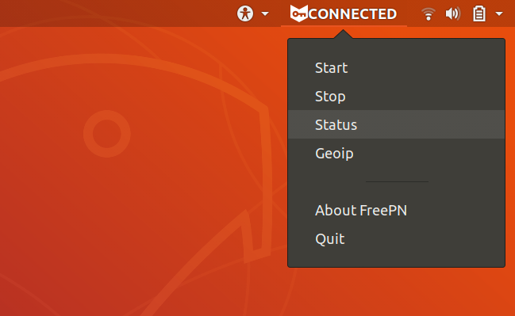

========================================
 fpnd - FreePN Network Daemon and Tools
========================================

.. image:: https://img.shields.io/github/license/freepn/fpnd
    :target: https://github.com/freepn/fpnd/blob/master/LICENSE

.. image:: https://img.shields.io/github/v/tag/freepn/fpnd?color=green&include_prereleases&label=latest%20release
    :target: https://github.com/freepn/fpnd/releases
    :alt: GitHub tag (latest SemVer, including pre-release)

.. image:: https://travis-ci.org/freepn/fpnd.svg?branch=master
    :target: https://travis-ci.org/freepn/fpnd

.. image:: https://img.shields.io/codecov/c/github/freepn/fpnd
    :target: https://codecov.io/gh/freepn/fpnd
    :alt: Codecov

.. image:: https://img.shields.io/codeclimate/maintainability/freepn/fpnd
    :target: https://codeclimate.com/github/freepn/fpnd

What FreePN is (and is not)
===========================

FreePN is a set of open source (see `FLOSS`_ definition) privacy tools for an
improved online `user experience`_ (and yes, there's even `an ISO standard`_
for that).

The FreePN network daemon (fpnd) is a P2P implementation of a distributed virtual
private network (dVPN) that creates an anonymous "cloud" of peers where each
peer is both a client node and an exit node.  Peers are randomly connected on
startup and reconnected to new (random) peers as needed.

The FreePN desktop user interface (`freepn-gtk3-tray`_) currently supports
GTK3-based `XDG-compliant desktop`_ environments, eg, Gnome, Unity, XFCE, and
derivatives.

FreePN is *not* a full VPN solution (eg, openvpn or vpnc) and does not
require setup of any pre-shared keys or certs.  Traffic over FreePN
network links is always encrypted, however, since each network link is
independent, the traffic must be decrypted as it passes out of each
peer host.  When running in "peer" mode, each peer is assumed to be an
untrusted host; when running in "adhoc" mode, the hosts can be assumed
to be trusted hosts (as they belong to the user).

.. _FLOSS: https://www.gnu.org/philosophy/floss-and-foss.en.html
.. _user experience: https://en.wikipedia.org/wiki/User_experience
.. _an ISO standard: https://en.wikipedia.org/wiki/ISO_9241#ISO_9241-210
.. _freepn-gtk3-tray: https://github.com/freepn/freepn-gtk3-tray
.. _XDG-compliant desktop: https://freedesktop.org/wiki/

Docs for FreePN tools
=====================

* `DNS Privacy`_ - DNS and your online privacy
* `DNS Setup`_ - Local DNS setup
* `Quick Start`_ - Quick install and setup instructions
* `Release Notes`_ - fpnd Software Version Description (latest release)
* `Change Log`_ - detailed change history
* `Old README`_ - previous (template-based) FOSS readme

.. _Release Notes: README_0.9.0-release-notes_DRAFT.rst
.. _Change Log: changelog.rst
.. _DNS Privacy: README_DNS_privacy.rst
.. _DNS Setup: README_DNS_setup.rst
.. _Old README: README_old.rst

Quick Start
===========

We assume you're reading this because you want to take back some control
over your online privacy, so the first thing you should do is read the
short `DNS Privacy`_ doc and then evaluate your own `DNS Setup`_ and
decide which `secure DNS providers`_ suit your needs.  If you've already
done that (or you're just *super* impatient ;) then proceed with the
following to install the software.

.. note:: You will need one of the supported Linux distributions below
          with *at least* Python 3.6 in order to run this software. On
          Gentoo you should also have a 5.x kernel.

.. _secure DNS providers: https://servers.opennicproject.org/

Tested Linux distributions
--------------------------

We test mainly on Gentoo and Ubuntu LTS (Bionic and Focal).  We've also
determined that 1) the default Python on Xenial lacks sufficient asyncio
support, so will *not* work out-of-the-box, and 2) Groovy (and Kali Linux)
now have an incompatible systemd version (so will not work until we have
a fix released).

Pre-install
-----------

Before you can install any FreePN packages, you'll need to add the required
package repository or overlay.

For all ubuntu series, make sure you have the ``gpg`` and ``add-apt-repository``
commands installed and then add the PPA:

::

  $ sudo apt-get install -y software-properties-common
  $ sudo add-apt-repository -y -s ppa:nerdboy/embedded

For Gentoo or derivatives based on `Portage`_, first install the portage
overlay.

Create a repos.conf file for the overlay and place the file in the
``/etc/portage/repos.conf`` directory.  Run::

  $ sudo nano /etc/portage/repos.conf/python-overlay.conf

and add the following content to the new file::

  [python-overlay]

  # Various python ebuilds for FreePN
  # Maintainer: nerdboy <nerdboy@gentoo.org>

  location = /var/db/repos/python-overlay
  sync-type = git
  sync-uri = https://github.com/freepn/python-overlay.git
  priority = 50
  auto-sync = yes

Adjust the path in the ``location`` field as needed, then save and exit nano.

Run the following command to sync the repo::

  $ sudo emaint sync --repo python-overlay

.. _Portage: https://wiki.gentoo.org/wiki/Portage

Install
-------

After following the pre-install setup, use the appropriate package manager
to install the package for your distro:

* Gentoo - ``sudo emerge freepn-gtk3-tray``
* Ubuntu - ``sudo apt-get install freepn-gtk3-indicator``

Then add your local ``<username>`` to the ``fpnd`` group:

* ``sudo usermod -aG fpnd <username>``

.. note:: Replace ``<username>`` with your actual login ID when you run
          the above command, then log out and log back in again.

Check your group memberships with the ``id`` command::

  $ id
  uid=1000(ubuntu) gid=1000(ubuntu) groups=1000(ubuntu),4(adm),20(dialout),24(cdrom),25(floppy),27(sudo),29(audio),30(dip),44(video),46(plugdev),115(netdev),118(lxd),995(fpnd)

If you really don't want/need a desktop, you can still install the network
component::

* Gentoo - ``sudo emerge net-misc/fpnd``
* Ubuntu - ``sudo apt-get install python3-fpnd``

Config Settings
---------------

Although there is currently no user config file for the GUI component,
the ``fpnd`` package installs the system settings file ``/etc/fpnd.ini``.
Most of the entries there to provide a consistent set of defaults for
different runtime environments, but some are intended for the end-user
to adjust when appropriate.

DNS settings:

* **route_dns**: Default is ``False``; only set to ``True`` if you've configured
  your global (plain-text) DNS settings to use an external/public DNS server, eg
  Cloudflare_
* **private_dns_only**: Default is ``False``; only set to ``True`` when you're
  alreafy running a `secure local DNS resolver`_, eg stubby_

Misc settings:

* **default_iface**: Default is ``None``; you should only need this *if* you
  have multiple network interfaces with active routes, then you should
  set this to the interface name you want FreePN to use
* **debug**: Default is ``True``; set this to ``False`` for slightly smaller
  log files

.. _Cloudflare: https://www.bleepingcomputer.com/news/security/cloudflares-1111-dns-passes-privacy-audit-some-issues-found/
.. _secure local DNS resolver: https://www.privacytools.io/providers/dns/
.. _stubby: https://dnsprivacy.org/wiki/display/DP/DNS+Privacy+Daemon+-+Stubby

Usage
-----

Select FreePN Tray Control from the Applications View or the Internet menu
in your desktop of choice, eg, Gnome, Unity, XFCE, etc.  You can also run
it from an X terminal to get some debug output.

::

  $ freepn-gtk3-indicator

    Gentoo Gnome profile (X1 Carbon)

    Ubuntu Bionic Desktop (Pinebook OG)
